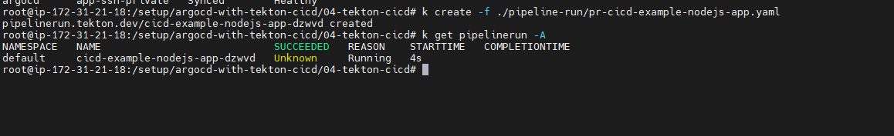

# Step-by-step guide to deploying CICD with Tekton Pipeline

I. Architecture CI/CD


1. Prerequisites
2. Build Infra with Terraform
```
cd ./02-infra-with-terraform
terraform init
terraform apply --auto-approve
```

3. Remote to Server configure with Public IP and public key


```
mkdir -p /setup
cd ./setup/
git clone https://github.com/ngocHung2000/argocd-with-tekton-cicd
cd ./argocd-with-tekton-cicd
alias k='microk8s kubectl'
alias kubectl='microk8s kubectl'
kubectl get all
```


- Access to resources
```
k get svc -A | grep NodePort
```


4. Access to Dashboard
- Tekton Dashboard
You can to access with dashboard to
```
http://3.80.36.168:31476/
```

- SonarQube Dashboard
```
http://3.80.36.168:9000/
```
- Default user/passwd of SonarQube is admin/admin

Change Passwd

Dashboard

- ArgoCD Dashboard
Make passwd of argocd user admin u can to run command here:
```
k get secret -n argocd argocd-initial-admin-secret -o jsonpath="{.data.password}" | base64 -d; echo
```

Change Passwd argocd: User Info -> Update Password -> Save

- Kubernetes Dashboard
Get token login dashboard
```
k get secret -n kube-system microk8s-dashboard-token -o jsonpath="{.data.token}" | base64 -d;echo
# access to dashboard
https://3.80.36.168:31851/
```


# Go back to Remote server tab
```
cd /setup/argocd-with-tekton-cicd/04-tekton-cicd
```
- Setup Storage Class and PV/PVC
```
k apply -f persistent-volumes/
k get sc
k get pvc
```

- Setup Secret Credentials
```
ssh-keygen -t rsa -C "tongochung1809@gmail.com"
```

1. Setup for github
Setting -> SSH and GPG keys -> New SSH key -> Copy Public Key and Paste to Github -> Add SSH key

Next Step you can to setup secret pull repo with tekton in right here

```
export PRIVATE_KEY_GITHUB=`cat /root/.ssh/id_rsa | base64`
echo $PRIVATE_KEY_GITHUB | tr -d ' '
```

secret argocd

setup dockerhub
acces to hub.docker.com and login to your account -> My Account -> Security -> New Access Token


Setup Sonarqube
Click Manual -> Input -> Setup -> Locally


Next Step Ucan to setup token login with secret on kubernetes


```
vi ./pipeline-run/pr-cicd-example-nodejs-app.yaml
```

Next step
1. Apply secret
```
k apply -f ./secrets/
k get secret -n default
k get secret -n argocd
```

2. Apply task
```
k apply -f ./task/
k get task -A
```

3. Apply Pipeline
```
k apply -f pipeline
k get pipeline -A
```

4. Apply Argocd
```
k apply -f ./argocd/
k get application -A
```

You can to see application on dashboard of argocd


5. Apply PipelineRun
```

```


sonarqube scan


argo sync

access my app

prometheus_deploy


deploy grafana with helm
```
kubectl patch svc -n prometheus stable-kube-prometheus-sta-prometheus -p '{"spec": {"type": "NodePort"}}'
kubectl patch svc -n prometheus stable-grafana -p '{"spec": {"type": "NodePort"}}'
```

grafana ui
```
kubectl get secret -n prometheus stable-grafana -o jsonpath="{.data.admin-password}" | base64 --decode; echo
```

Import Dashboard 15760


Import 


Deploy ELK with Helm chart
```
helm repo add elastic https://helm.elastic.co
```