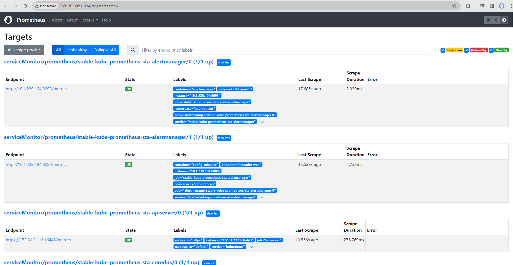
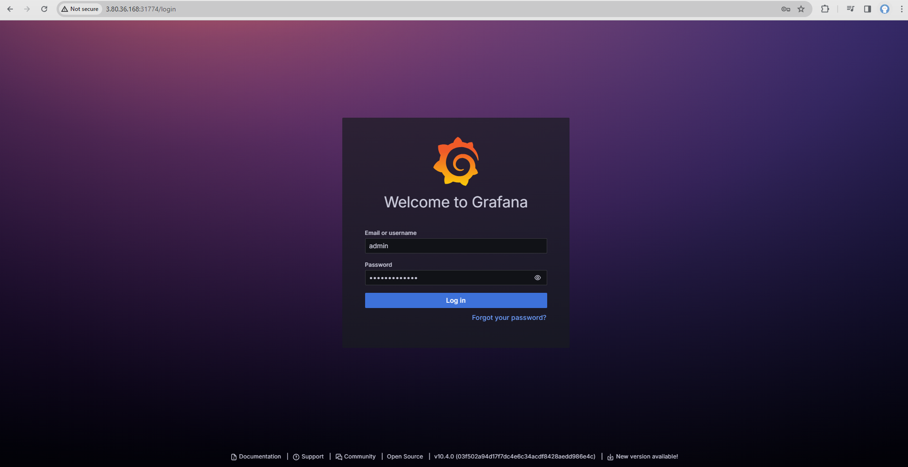

# DevOps Realtime CI/CD with Tekton

- Step-by-step guide to deploying CICD with Tekton Pipeline

I. CI/CD architecture


1. Prerequisites

- First you need to log in to AWS CLI with aws cli
[aws cli ](https://docs.aws.amazon.com/cli/latest/userguide/getting-started-quickstart.html)
- Create a [key pair ](https://docs.aws.amazon.com/AWSEC2/latest/UserGuide/create-key-pairs.html ) as follows:

```
aws ec2 create-key-pair --key-name cicd --query 'KeyMaterial' --output text > cicd.pem
```

2. Deploy AWS infrastructure with terraform as follows:

```

cd ./02-infra-with-terraform

terraform init

terraform apply --auto-approve

```
**As a result we will see the output as the Public IP of the EC2 Instance we created**


3. Next, we need to access the server via the public key that was previously installed


- Then we clone the repo and see if the microk8s resource has been created as follows:
```
mkdir -p /setup

cd ./setup/

git clone https://github.com/ngocHung2000/argocd-with-tekton-cicd

cd ./argocd-with-tekton-cicd

alias k='microk8s kubectl'

alias kubectl='microk8s kubectl'

kubectl get all

```


- Displays ports of created resources ArgoCD, Tekton, Kube Dashboard

```

k get svc -A | grep NodePort

```


4. Visit our Dashboard page

- Tekton Dashboard

Mapping with the NodePort that we exposed earlier, we can access Tekton's Dashboard page with the Port as follows:

```

http://3.80.36.168:31476/

```


- Access SonarQube's dashboard with Port **9000** as follows:

```

http://3.80.36.168:9000/

```

- The default username and password of SonarQube will be admin/admin


- Enter and correct your password


- SonarQube Dashboard


- Similar to Tekton Dashboard, we access ArgoCD Dashboard as follows

- First we need to get the password of the argocd admin user with the following command


```

k get secret -n argocd argocd-initial-admin-secret -o jsonpath="{.data.password}" | base64 -d; echo. echo

```


- To change Argocd's password: **User Info** -> **Update Password** -> **Save**


- Access to the Kubernetes Dashboard

First we also need to get the login token to kubernetes dashboard as follows:

```

k get secret -n kube-system microk8s-dashboard-token -o jsonpath="{.data.token}" | base64 -d;echo

# access to dashboard

https://3.80.36.168:31851/

```


- **As a result, we have the following dashboard**


5. Returning to the Remote Server screen, we start deploying CI/CD with Tekton as follows

```

cd /setup/argocd-with-tekton-cicd/04-tekton-cicd

```

- Setup Storage Class and PV/PVC

```

k apply -f persistent-volumes/

k get sc

k get pvc

```


- Setup Secret Credentials

```

ssh-keygen -t rsa -C "hungtn29"

```


- Setup for github: Go to **Setting** -> **SSH and GPG keys** -> **New SSH key** -> Copy Public Key and Paste to Github -> **Add SSH key**


- Next step, we need to configure the secret pull repo for Tekton as follows:

```

export PRIVATE_KEY_GITHUB=`cat /root/.ssh/id_rsa | base64`

echo $PRIVATE_KEY_GITHUB | tr -d ' '

```


- Edit the github Secret for ArgoCD as follows
```
vi sc-argocd-private-repo-git.yaml
```


- Configure Access Token for Docker Registry as follows: Login to your account -> **My Account** -> **Security** -> **New Access Token**


- Correct the Registry Credential as follows:

```
echo "YOUR_USERNAME" | base64
echo "YOUR_ACCESS_TOKEN" | base64
vi sc-registry-credential.yaml
```

- SonarQube configuration: Access the SonarQube Dashboard -> **Click Manual** -> **Input** -> **Setup** -> **Locally**


- Create Project


- Next we need to create a Secret Token Login for SonarQube as follows:


- Correct the Token file for Sonarqube Secret
```
vi sc-sonarqube-scanner-token.yaml
```


- Correct the Pipeline Run file to match the necessary parameters of your Public IP, Username and Password
```
en ./pipeline-run/pr-cicd-example-nodejs-app.yaml
```


II. Apply the configurations and execute CICD n

1. Apply secret

```

k apply -f ./secrets/

k get secret -n default

k get secret -n argocd

```


2. Apply tasks

```

k apply -f ./task/

k get task -A

```


3. Apply Pipeline

``

k apply -f pipeline

k get pipeline -A

```


4. Apply Argocd

```

k apply -f ./argocd/

k get application -A

```


- You can see the created application on ArgoCD's interface as shown:


5. Apply PipelineRun

```
k create -f ./pipeline-run/pr-cicd-example-nodejs-app.yaml
```


- We can also see it on Tekton's Dashboard page as shown


- We can also see SonarQube's Scan step on their Dashboard page as follows


- The results of Pipeline Run are as follows


- After Pipeline Run is successful, ArgoCD will automatically synchronize and Deploy your Application as follows:


- I'm letting my application run under Port 32766 and accessing my application as follows


III. Deploy Monitoring infrastructure with Grafana and Prometheus

1. Configure Prometheus
```
helm repo add prometheus-community https://prometheus-community.github.io/helm-charts
kubectl create ns prometheus
helm install stable prometheus-community/kube-prometheus-stack -n prometheus
```


- Expose Prometheus with NodePort as follows:
```
kubectl patch svc -n prometheus stable-kube-prometheus-sta-prometheus -p '{"spec": {"type": "NodePort"}}''
```


- We can visit the Prometheus page and see some of the parameters that Prometheus has collected as follows:




2. Grafana

- Expose Grafana with NodePort as follows:
```
kubectl patch svc -n prometheus stable-grafana -p '{"spec": {"type": "NodePort"}}''
```

```

kubectl patch svc -n prometheus stable-kube-prometheus-sta-prometheus -p '{"spec": {"type": "NodePort"}}''

kubectl patch svc -n prometheus stable-grafana -p '{"spec": {"type": "NodePort"}}''

```

- Access to Grafana:

```
# Show default password
kubectl get secret -n prometheus stable-grafana -o jsonpath="{.data.admin-password}" | base64 --decode; echo. echo

```




- Import Dashboard Pod as follows: 15760


- Import Dashboard Mem as follows: 12740


